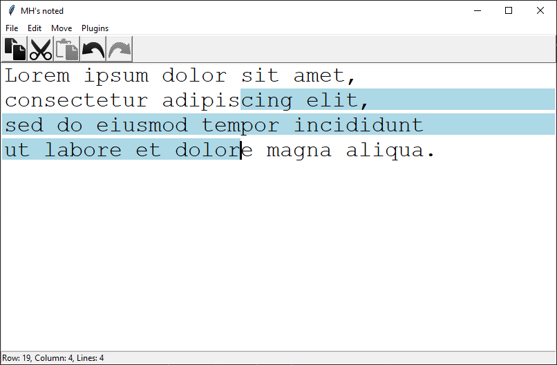
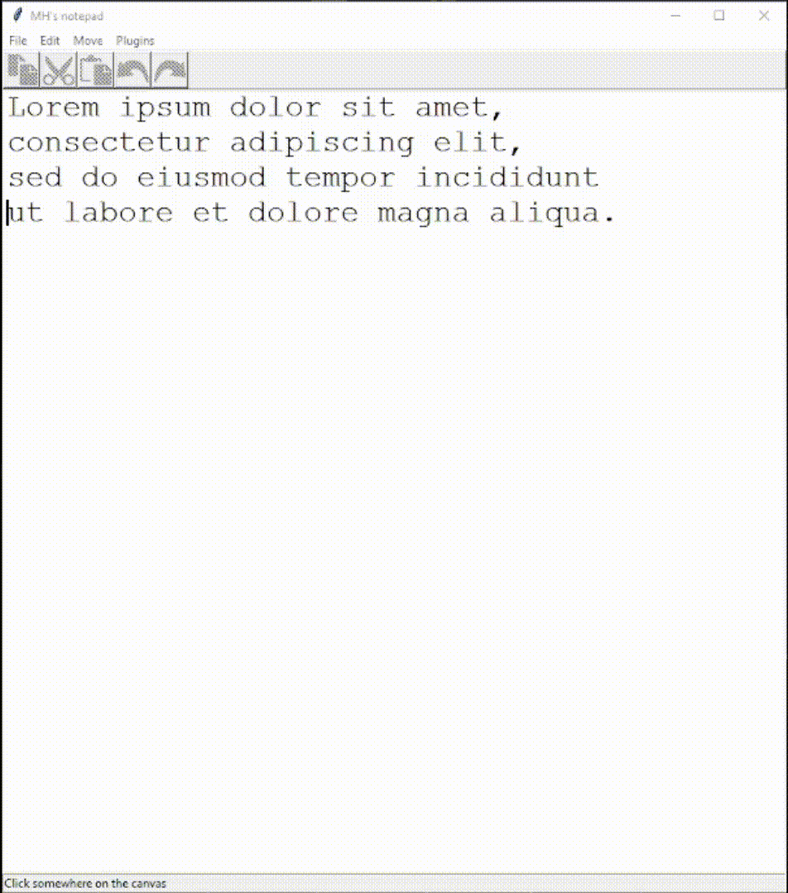

# Noted - simple text editor



## Purpose

Noded is a simple text editing program, based on a model-view architecture. Created as an exercise of programming patterns and program extendability, it features:

- Dynamic plugins: any Python class implementing `Plugin` and placed in `/plugins` will be loaded and can freely interact with the program
- Clipboard: any selected text (highlighted in blue) can be copied/cut and pasted (`ctrl + c/x` and `ctrl + v`)
- Command pattern: undo and redo support (`ctrl + z` and `ctrl + y`) for simple user actions and for tools and plugins.
- Text input and editing: UTF characters, whitespaces, return, delete, enter, all the usual stuff.



## Installation and running

Noted has no dependencies or install requirements. Simply run the main.py in your favorite python-supporting console

```
python main.py
```
